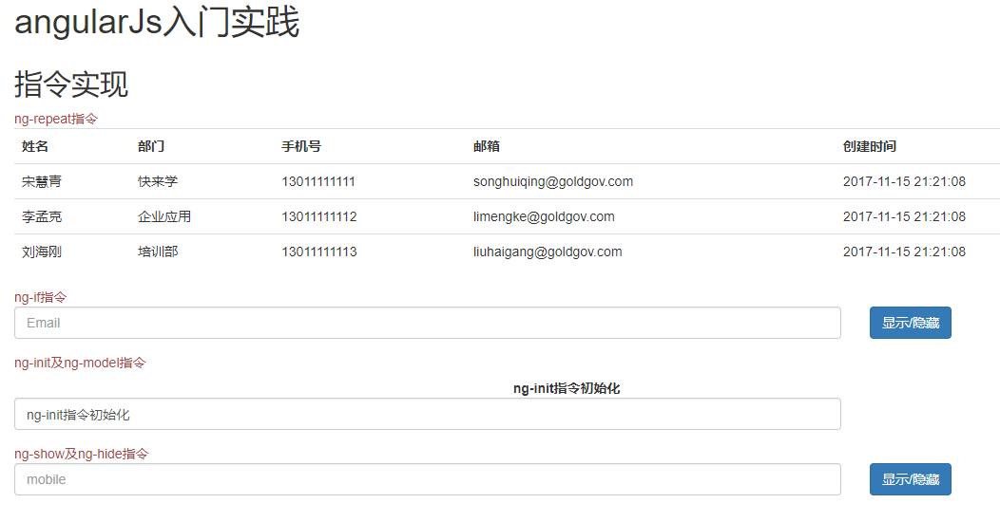
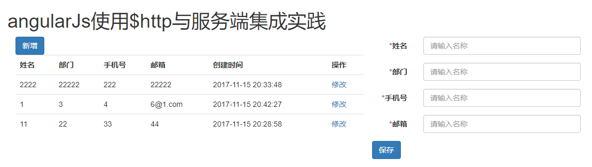
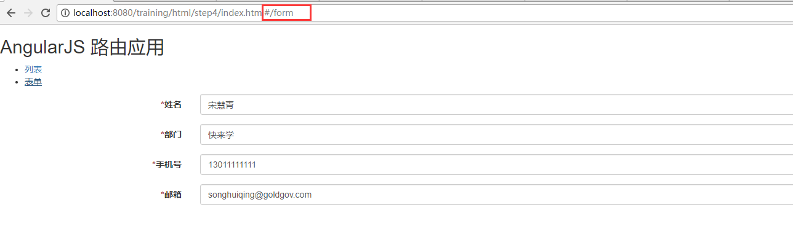
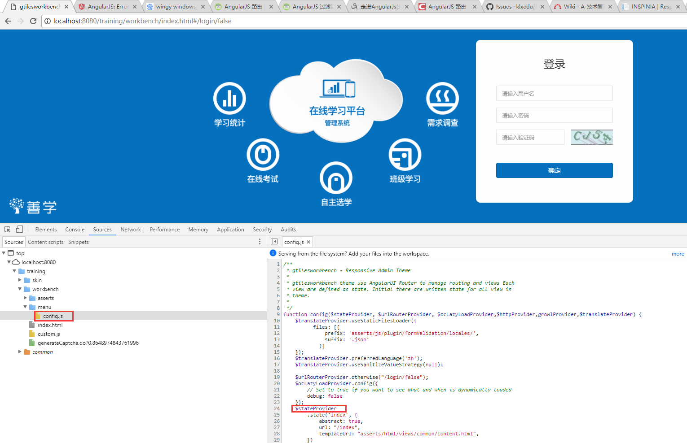
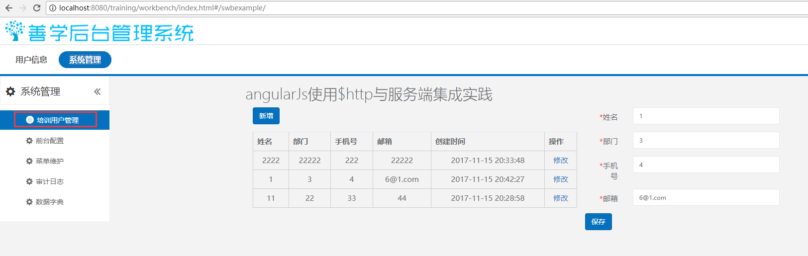

## 后端开发培训过程

### step1 SSM实践

> 请参照 **org.gtiles.training.example** 包中SSM标准书写方式，包括：web、service、dao。

#### SSM框架说明

> SSM框架，是Spring SpringMVC Mybatis的简称。在产品中主要用到的是spring4及Mybatis3。在产品中Spring及SpringMVC的使用是标准方法，产品平台封装的注解等可以在后续过程中熟悉，这里不做介绍。特别说明Mybatis的Dao，需要标注产品注解**@MybatisRepository**，请知晓。

> 当前演示项目中，spring及spring mvc的配置文件在resource的gtiles-config/spring-config/core目录中。默认数据库配置请见config.properties

**练习**
- 请实现insqll.sql中TRAINING_DETAIL结构模块，对应实体定义请见TrainingDetail
- 主要以熟悉代码结果为主，禁止使用自动化生成工具实现

### step2 angularJs入门实践

> 请访问以下地址：  **http://localhost:8080/training/html/step2/index.html** ，本节主要对angularJs的基本指令进行熟悉

**练习**
- **ng-repeat** 指令，主要进行列表循环。
- **ng-if** 指令，主要控制元素是否渲染。
- **ng-init** 指令，作用域变量初始化。
- **ng-model** 指令，值绑定，把表单元素与作用域中的变量进行绑定。
- **ng-show ng-hide** 指令，显示或隐藏。

**界面效果**


### step3 angularJs使用$http与服务端集成实践

> 请访问以下地址：  **http://localhost:8080/training/html/step3/index.html** ，本节主要对angularJs与服务端集成过程进行熟悉

#### $http服务

> $http是angularJs的一个核心服务，用于读取远程服务器的数据。和jquery的ajax方法原理一致。$http的语法详情可见  **http://www.runoob.com/angularjs/angularjs-http.html** 。本章特地说明，$http的post请求发送一个对象，不是标准的表单提交请求格式。发送的是一个playload请求，数据对象是json。后台想要接收的话，必须使用 **@RequestBody** 接收。这显然不是我们想要的。目前的处理方式如下：其中data要通过jquery的param方法进行转换，增加表单提交请求头。

```js
$http({
	method : "post",
	url : '../../trainingUser/saveOrUpdate.json',
	data : $.param(data),
	headers:{'Content-Type': 'application/x-www-form-urlencoded'}
});
```

**练习**
- 请实现step1中后台代码的界面集成
- 包含标准的增、删、改、查动作。

**界面效果**


### step4 angularJs路由实践

> 请访问以下地址：  **http://localhost:8080/training/html/step4/index.html#/** ，本节主要对angularJs单页面特性进行熟悉

> AngularJS 路由允许我们通过不同的 URL 访问不同的内容。通过 AngularJS 可以实现多视图的单页Web应用（single page web application，SPA）。通常我们的URL形式为 http://runoob.com/first/page，但在单页Web应用中 AngularJS 通过 # + 标记 实现，例如：


```
http://runoob.com/#/first
http://runoob.com/#/second
http://runoob.com/#/third
```

**练习**
- 请按照提供的示例自行实现模拟路由实现。
- 需要包含：默认路由地址及最少3个路由界面，每个路由界面都必须有自己的controller，并和界面进行值绑定渲染。

**界面效果**


### step5 angularJs指令及过滤器实践

> 请访问以下地址：  **http://localhost:8080/training/html/step5/index.html#/** ，本节主要对angularJs自定义指令和过滤器进行熟悉

#### 指令含义

- AngularJS 通过被称为 指令 的新属性来扩展 HTML。
- AngularJS 通过内置的指令来为应用添加功能。
- AngularJS 允许你自定义指令。

#### 指令说明

- AngularJS 指令是扩展的 HTML 属性，带有前缀 ng-。
- ng-app 指令初始化一个 AngularJS 应用程序。
- ng-init 指令初始化应用程序数据。
- ng-model 指令把元素值（比如输入域的值）绑定到应用程序。
- 具体指令及事件请参考 **http://www.runoob.com/angularjs/angularjs-reference.html** 

#### 过滤器说明

- 过滤器可以使用一个管道字符（|）添加到表达式和指令中。
- 内置的过滤器有 currency、filter、lowercase、orderBy、uppercase，详见 **http://www.runoob.com/angularjs/angularjs-filters.html** 
- 用户可以自定义过滤器，具体方式请参考示例

**练习**
- 请按照提供的示例自行实现模拟自定义指令及过滤器。
- 需要包含：指令及过滤器的值必须与对应controller中的值进行绑定，不能直接使用静态html界面。

**界面效果**


### step6 angularJs在产品中使用实践

#### 组件结构概况

- **ComponentPlugin.java**，插件类，定义了组件的相关内容，包括依赖关系。
- **install.script**，组件安装脚本目录，所有组件初始化脚本都在insall_mysql.sql中进行初始化
- **workbench**，产品界面包，包含了功能界面及**菜单UIState定义类(UIState.java)**
- 其他包结构定义，请见 [组件开发说明文档](./files/快来学组件开发说明.doc)。

#### 产品平台中后台管理功能实现原理

#### 产品管理功能路由实现

> 产品管理功能使用的angularjs的ui-router插件实现，不是基础的angular router，操作方式一致。基本实现过程如下：

- 产品swb后台，根据每个组件的UIState获取路由关系生成config.js，路由文件，主要定义的就是url对应使用的异步加载文件及对应的界面。
- 用户点击菜单state，打开config中对应state配置的界面，同时异步加载依赖文件。



#### 产品管理功能实现过程

- 创建功能菜单初始化SQL，包含菜单、权限组、权限点，菜单编码与权限组编码保持一致。

```sql
-- 菜单初始化
INSERT INTO `gt_swb_menu` (`MENUID`, `MENUCODE`, `MENUNAME`, `MENUORDER`, `ISSHOW`, `MENUGRPID`, `LINK_MENU_ID`, `MENU_ICON`, `SUB_MENU_GROUP`) 
	VALUES ('uuid-menugrp-swb-example', 'example', '培训用户管理', '9', '1', 'uuid-menugrp-swb', NULL, 'iconfont icon-kaoshijilu', '');
-- 权限点初始化
INSERT INTO `gt_auth_res_group` (`RES_GROUP_ID`, `RES_GROUP_NAME`, `RES_GROUP_CODE`, `RES_GROUP_TYPE`, `OPERATOR`, `OPERATOR_ID`, `UPDATE_TIME`) 
	VALUES ('uuid-menugrp-swb-example', '培训用户管理', 'example', '1', 'admin', 'admin', '2016-08-12 14:05:51');
INSERT INTO `gt_auth_resource` (`RESOURCE_ID`, `RESOURCE_NAME`, `RESOURCE_CODE`, `RESOURCE_VALUE`, `DESCRIPTION`, `IS_AUDIT_LOG`, `RES_GROUP_ID`, `OPERATOR`, `OPERATOR_ID`, `UPDATE_TIME`) 
	VALUES ('uuid-menugrp-swb-example-find', '查询', 'example-find', '', '查询', '2', 'uuid-menugrp-swb-example', 'admin', 'admin', '2016-08-12 14:14:52');
INSERT INTO `gt_auth_resource` (`RESOURCE_ID`, `RESOURCE_NAME`, `RESOURCE_CODE`, `RESOURCE_VALUE`, `DESCRIPTION`, `IS_AUDIT_LOG`, `RES_GROUP_ID`, `OPERATOR`, `OPERATOR_ID`, `UPDATE_TIME`) 
	VALUES ('uuid-menugrp-swb-example-manage', '维护', 'example-manage', '', '维护', '2', 'uuid-menugrp-swb-example', 'admin', 'admin', '2016-08-12 14:14:52');
```
- 创建UIState类（如不存在），具体定义过程及含义，参照**ExampleMenuUIState**。
- 根据UIState中的内容创建界面文件，参照**example/index.html example/exampleService.js example/exampleCtrl.js**，其中angular的模块定义语句的js必须优先引用。
- **特别声明：**angularJs，请按照mvc的结构思路进行理解，.html是视图层，效果展示；.xxxCtrl.js是控制层，主要和html进行交互，xxxService.js是模型层，主要控制与服务器进行数据交互。
- 后台管理端访问地址：[http://localhost:8080/training/workbench/index.html](http://localhost:8080/training/workbench/index.html)，用户名/密码：admin/111111

